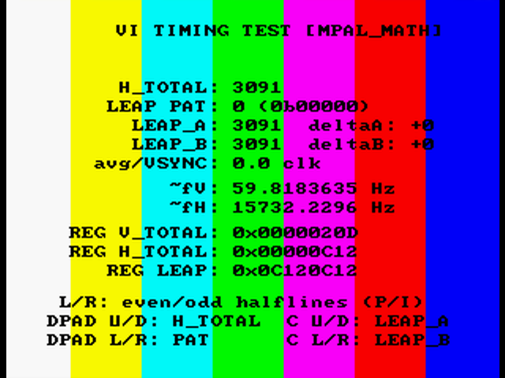

## VI timing test ROM for N64

this tool allows adjusting VI timing values in real time to observe hardware effects. in particular, the initial goal is to be able to quickly iterate appropriate presets for MPAL

see https://github.com/DragonMinded/libdragon/issues/884 for more details.

---

initial testing shows promise with the following profiles, per N64brew Discord PAL-M tester AAIC:

**MPAL_MATH (progressive):**  
H_TOTAL 3091  
LEAP pattern: 0  
LEAP_A: 3098  
LEAP_B: 3098 (not used due to pattern 0 = always use LEAP_A)  

In libdragon preview macro convention, that is:  
H_TOTAL: 772.75  
Pattern: 0b00000  
LEAP_A: 774.50  
LEAP_B: 774.50  

---

**MPAL_INT (interlaced):**  
H_TOTAL: 3091  
LEAP pattern: 0  
LEAP_A: 3096  
LEAP_B: 3096 (not used due to pattern 0)  

H_TOTAL: 772.75  
Pattern: 0b00000  
LEAP_A: 774.00  
LEAP_B: 774.00  

more testing needed. i'm updating the "math" profile in the latest version of the tool to use 3098 for LEAP_A.

---

this tool works very similarly to the [VI timing calculator](https://meauxdal.neocities.org/n64-vi-calculator). you can adjust VI registers dynamically and see the results:

- d-pad up & down: increases or decreases VI_H_TOTAL
- d-pad right & left: increases or decreases the leap pattern (0-31)
- c-up & c-down: increases or decreases LEAP_A
- c-right & c-left: increases or decreases LEAP_B
- L/R buttons: L = progressive (default), R = interlaced
- A button: "resets" V_BURST - maybe this has some impact on the MPAL color bug

LEAP_A/B are clamped to >= VI_H_TOTAL as this tool is not intended to explore negative leap deltas. this can easily be changed if desired.

---

each ROM has different default values:

mpal
- **mpal_math** - mpal progressive; closest to nominal line frequency updated to use a LEAP_A delta of +7 
- **mpal_int** - mpal interlaced; closest to nominal line frequency updated to use a LEAP_A delta of +5
- **mpal_old** - the old mpal progressive-only profile - no longer exists in libdragon preview
- **mpal_preview** - the old mpal interlaced-only profile. applies to both interlaced and progressive in libdragon preview

ntsc
- **ntsc** 

pal
- **pal_1996** - original pal profile (libdragon)
- **pal_1997** - "corrected" pal profile in libultra (not used in libdragon)
- **pal60** - libdragon's pal60 profile

---

some versions of the ROM trigger the color bug on early MPAL units mentioned here: https://github.com/DragonMinded/libdragon/blob/preview/src/vi.c#L274

this is hopefully fixed now, though.

---

#### disclaimers: LLM assistance was used to create this. be mindful there aren't any real guardrails; i'm not responsible if you manage to damage your TV or whatever else, though I don't think this is a particularly probable risk.