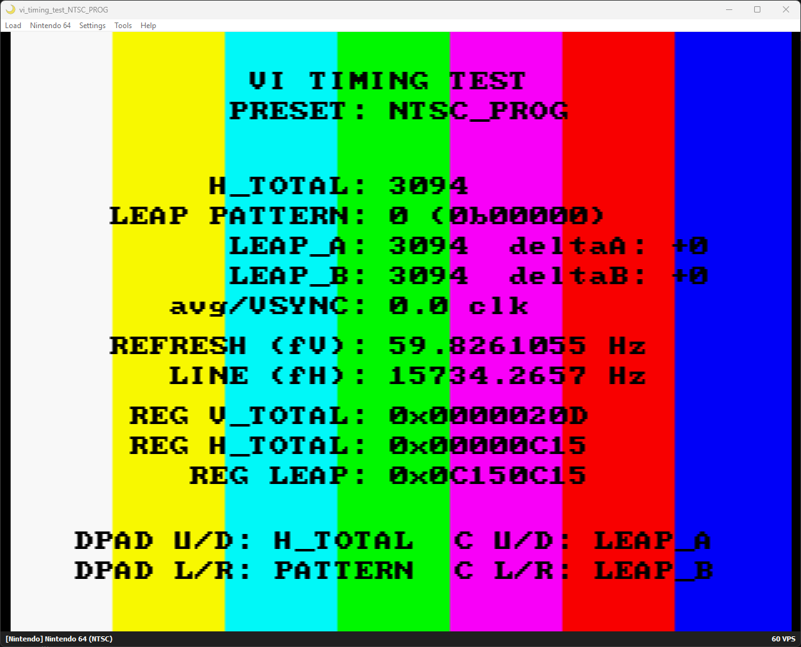

## VI timing test ROM for N64

this tool allows adjusting VI timing values in real time to observe hardware effects. in particular, the initial goal is to be able to quickly iterate appropriate presets for MPAL

see https://github.com/DragonMinded/libdragon/issues/884 for more details.

---

initial testing shows promise with the following profiles, per N64brew Discord PAL-M tester AAIC:

**MPAL_PROG (progressive):**  
H_TOTAL 3091  
LEAP pattern: 0  
LEAP_A: 3098  
LEAP_B: 3098 (not used due to pattern 0 = always use LEAP_A)  

In libdragon preview macro convention, that is:  
H_TOTAL: 772.75  
Pattern: 0b00000  
LEAP_A: 774.50  
LEAP_B: 774.50  

---

**MPAL_INT (interlaced):**  
H_TOTAL: 3091  
LEAP pattern: 0  
LEAP_A: 3096  
LEAP_B: 3096 (not used due to pattern 0)  

H_TOTAL: 772.75  
Pattern: 0b00000  
LEAP_A: 774.00  
LEAP_B: 774.00  

---

this tool works very similarly to the [VI timing calculator](https://meauxdal.neocities.org/n64-vi-calculator). you can adjust VI registers dynamically and see the results:

- d-pad up & down: increases or decreases VI_H_TOTAL
- d-pad right & left: increases or decreases the leap pattern (0-31)
- c-up & c-down: increases or decreases LEAP_A
- c-right & c-left: increases or decreases LEAP_B

LEAP_A/B are clamped to >= VI_H_TOTAL as this tool is not intended to explore negative leap deltas.

---

- INT: interlaced
- PROG: progressive
- PAL_1996: original PAL leap configuration
- PAL_1997: revised PAL leap configuration
- PAL60: NTSC lines/timing with PAL color
